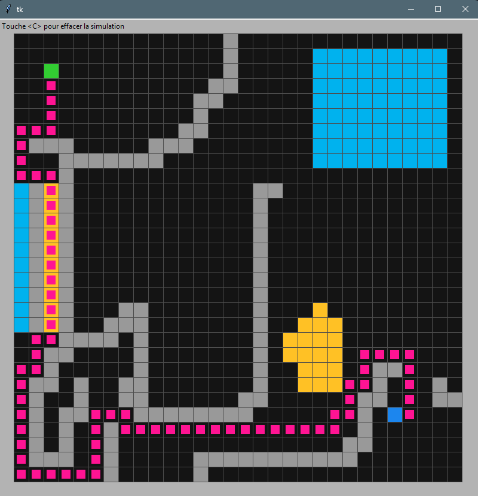

# pathfinding

Exploration of pathfinding algorithms :

- BFS
- Dijkstra
- A\*

User interface available to draw your maze, or generate a random one using DFS and try it out !

Gestion du coût des cellules (sable, eau)



## Installation / Usage

```bash
uv run main.py
```
